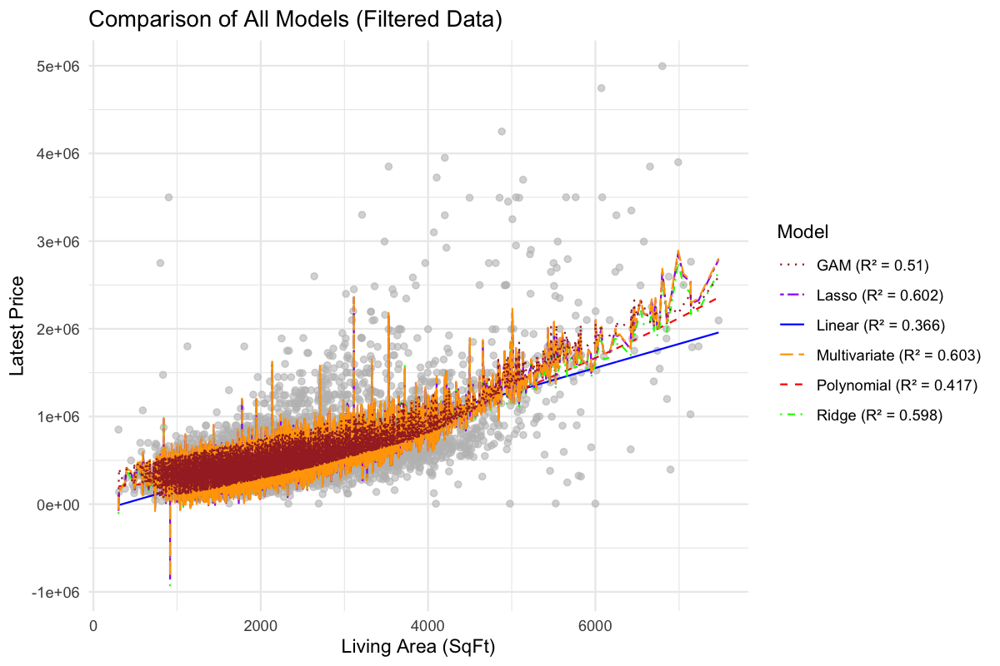
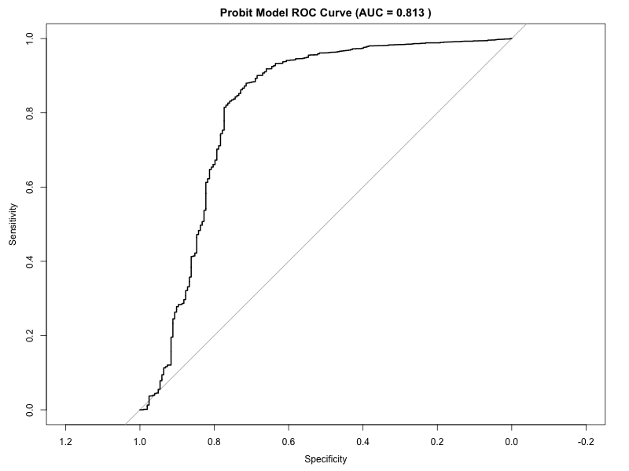
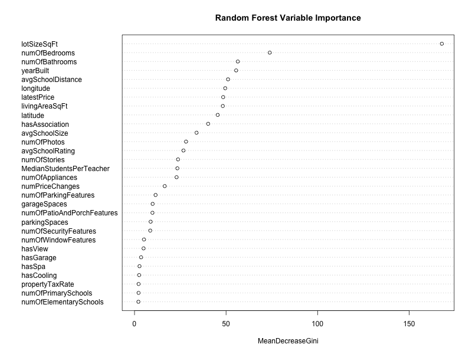

---

## **Objectives**

### **1. Regression Analysis**
- **Goal**: Predict the `latestPrice` of homes based on features such as:
  - `livingAreaSqFt`
  - `yearBuilt`
  - Other relevant variables
- **Models Used**:
  - Linear Regression
  - Polynomial Regression
  - Ridge Regression
  - Lasso Regression
  - Multivariate Linear Regression
  - Generalized Additive Model (GAM)

### **2. Classification Analysis**
- **Goal**: Predict the `homeType` (e.g., Single Family, Condo) based on features such as:
  - `livingAreaSqFt`
  - `yearBuilt`
  - Other relevant variables
- **Models Used**:
  - Logistic Regression
  - Probit Model
  - Decision Tree
  - Random Forest
  - Support Vector Machine (SVM)

---

## **Results**

### **Regression Analysis**
The following table summarizes the R² values for each regression model:

| Model                | R² Value |
|----------------------|----------|
| Linear Regression    | `...`    |
| Polynomial Regression| `...`    |
| Ridge Regression     | `...`    |
| Lasso Regression     | `...`    |
| Multivariate Model   | `...`    |
| GAM                  | `...`    |

#### **Visualizations**
1. **Comparison of All Models**  
   

2. **Filtered Data Models**  
   

---

### **Classification Analysis**
The following table summarizes the accuracy and AUC for each classification model:

| Model                | In-Sample Accuracy | Out-of-Sample Accuracy | AUC   |
|----------------------|--------------------|------------------------|-------|
| Logistic Regression  | `...`             | `...`                 | `...` |
| Probit Model         | `...`             | `...`                 | `...` |
| Decision Tree        | `...`             | `...`                 | N/A   |
| Random Forest        | `...`             | `...`                 | `...` |
| SVM                  | `...`             | `...`                 | N/A   |

#### **Visualizations**
1. **Logistic Regression ROC Curve**  
   

2. **Probit Model ROC Curve**  
   

3. **Decision Tree Visualization**  
   

4. **Random Forest Variable Importance**  
   

---

## **How to Run the Project**

### **1. Set Up the Environment**
Ensure the following R libraries are installed:
```r
install.packages(c("caret", "glmnet", "MASS", "mgcv", "e1071", "ggplot2", "corrplot", "rpart.plot", "randomForest", "pROC"))