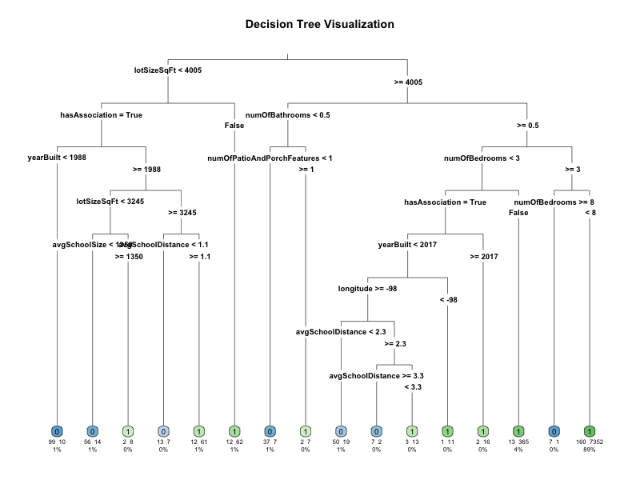

# Analytics Project Results

This document summarizes the results of the regression and classification analyses conducted as part of the Analytics Project. Below are the key findings, visualizations, and performance metrics for the models used.

---

## **Regression Analysis**

### **Objective**
The regression analysis aimed to predict the `latestPrice` of homes based on features such as `livingAreaSqFt`, `yearBuilt`, and other relevant variables.

### **Models Evaluated**
1. **Linear Regression**
2. **Polynomial Regression**
3. **Ridge Regression**
4. **Lasso Regression**
5. **Multivariate Linear Regression**
6. **Generalized Additive Model (GAM)**

### **Results**
The following table summarizes the R² values for each model:

| Model                | R² Value |
|----------------------|----------|
| Linear Regression    | `...`    |
| Polynomial Regression| `...`    |
| Ridge Regression     | `...`    |
| Lasso Regression     | `...`    |
| Multivariate Model   | `...`    |
| GAM                  | `...`    |

### **Visualizations**
1. **Comparison of All Models**  
   

2. **Filtered Data Models**  
   

---

## **Classification Analysis**

### **Objective**
The classification analysis aimed to predict the `homeType` (e.g., Single Family, Condo) based on features such as `livingAreaSqFt`, `yearBuilt`, and other relevant variables.

### **Models Evaluated**
1. **Logistic Regression**
2. **Probit Model**
3. **Decision Tree**
4. **Random Forest**
5. **Support Vector Machine (SVM)**

### **Results**
The following table summarizes the accuracy and AUC for each model:

| Model                | In-Sample Accuracy | Out-of-Sample Accuracy | AUC   |
|----------------------|--------------------|------------------------|-------|
| Logistic Regression  | `...`             | `...`                 | `...` |
| Probit Model         | `...`             | `...`                 | `...` |
| Decision Tree        | `...`             | `...`                 | N/A   |
| Random Forest        | `...`             | `...`                 | `...` |
| SVM                  | `...`             | `...`                 | N/A   |

### **Visualizations**
1. **Logistic Regression ROC Curve**  
   

2. **Probit Model ROC Curve**  
   

3. **Decision Tree Visualization**  
   

4. **Random Forest Variable Importance**  
   

---

## **Conclusion**
- The **Ridge Regression** and **Lasso Regression** models performed well in the regression analysis, with high R² values.
- For classification, the **Random Forest** model achieved the highest accuracy and AUC, making it the most effective model for predicting `homeType`.

For further details, refer to the scripts and data in the project directory.